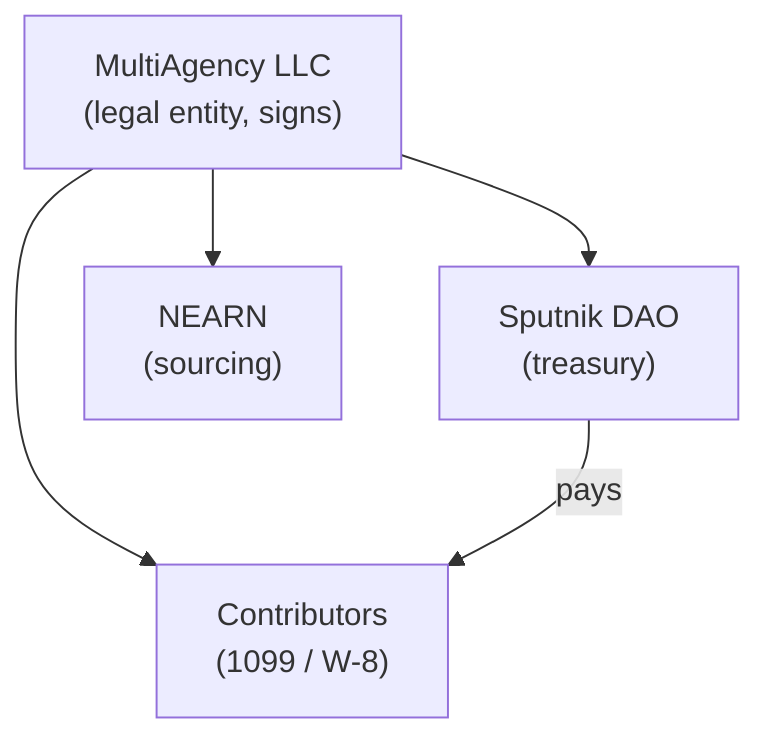

# Entity

> **Not legal or tax advice.** These pages describe how MultiAgency LLC is structured and operates — one working example, not a prescription. Entity types, tax treatment, and worker-classification rules vary by jurisdiction and change over time. Before adapting this model, get qualified legal and tax counsel in the jurisdiction where your agency and contributors operate. This is an early draft, published to gather feedback — expect it to change.

## What MultiAgency LLC is

MultiAgency LLC is a **single-member Limited Liability Company**. It is the legal counterparty for everything the agency does:

- **It operates the treasury.** The on-chain treasury is a Sputnik DAO contract (surfaced through Trezu). Spending happens through the DAO's policy — Transfer proposals voted by the roles that policy defines.
- **It contracts with contributors.** Every contributor relationship is with MultiAgency LLC — structured as an independent-contractor engagement on a 1099 basis (W-9 for US persons, W-8BEN for non-US individuals). Classification ultimately turns on facts and local law, not the label.
- **It signs and counter-signs.** Master services agreements and per-project work orders are issued by, and bind, the LLC.

## What MultiAgency LLC is not

MultiAgency LLC does **not**:

- **Direct day-to-day work.** Contributors decide how and when they execute their scope. The LLC defines deliverables and deadlines, not methods or hours.
- **Provide tools, benefits, or training.** No equipment, no salary, no PTO, no health benefits. The arrangement is built around the contributor being in business for themselves.
- **Commingle funds.** Treasury funds stay in the DAO. Personal expenses do not pass through the LLC, and LLC expenses do not pass through a personal account.

## Where the LLC sits in the stack

Trezu is the UI over the Sputnik DAO. NEARN is the inbound channel for contributors and the helper that turns a paid bounty into a Sputnik proposal. The dashboard is the agency's own operating console on top of all of it.

## What this model does not handle

This is a working example, not a turnkey compliance system. Gaps a new agency closes on its own:

- **Non-US tax.** The W-9 / W-8BEN / 1099-NEC flow across these pages is US practice; other jurisdictions differ.
- **Money transmission.** Paying in NEAR-network tokens can raise money-transmitter and tax-characterization questions this model doesn't address.
- **Data protection.** Contributor PII — names, addresses, tax residence, tax IDs — sits with the operator. GDPR and similar regimes may apply; the model doesn't address them.

## Today vs. shaped-into

- **Today:** one LLC, one DAO, one admin/approver. Single-tenant.
- **Shaped into:** a model that other agencies can adopt — same LLC pattern, same dashboard, their own DAO and contributors.

This page describes the current state; the replication path is covered separately.

## Related

- [Contributors](/docs/contributors) — onboarding flow end-to-end
- [Services agreement](/docs/services-agreement) — what's in the master agreement
- [Work order](/docs/work-order) — per-project scope, payment, IP
- [Trezu](/docs/trezu) — treasury layer
- [NEARN](/docs/nearn) — contributor sourcing + payout
