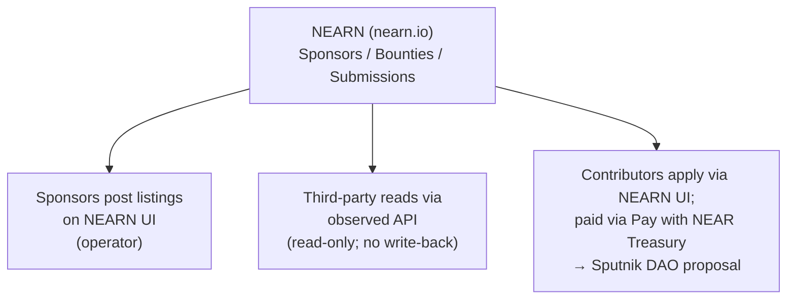

# NEARN skill

## When to use this skill

Read this skill when:

- Reading NEARN listings or sponsor bounties from any backend
- Deciding whether to mirror NEARN content locally or link out
- Adding a public-facing surface that should defer to NEARN for narrative
- Storing NEARN sponsor slugs or listing slugs as foreign-key references
- Debugging a NEARN integration that broke after an upstream change

## System diagram



## What NEARN is

NEARN (`nearn.io`) is a talent marketplace for the NEAR ecosystem. Sponsors (agencies, DAOs, projects) post listings; contributors apply or submit work; payouts happen in crypto (USDC, NEAR, other tokens) released by the sponsor. Categories: Content, Design, Development, Other. A single account can act as both contributor and sponsor.

NEARN's codebase is a **fork of [`SuperteamDAO/earn`](https://github.com/SuperteamDAO/earn)** maintained by NEAR-DevHub at [`NEAR-DevHub/nearn`](https://github.com/NEAR-DevHub/nearn). Tech stack: Next.js (TypeScript) + MySQL/Prisma + NextAuth (Google OAuth + email magic link). NEAR wallet integration is **wallet-linking, not wallet-auth**: an authenticated user can attach a NEAR `publicKey` to their account via `/api/user/update` (validated as a NEAR address), but the auth identity is always Google/email — there is no NEAR wallet sign-in flow.

Public docs (`https://docs.nearn.io/`) are user-facing only — no API reference, no integration guide, no webhook spec. The endpoints third-party integrations rely on are observed from NEARN's own frontend (Next.js API routes under `src/pages/api/`) and may change without notice.

## Two layers of NEARN identity

Most integrations need to track two distinct slugs:

| Layer            | What it is                                                                            | Used for                                                                                                  |
| ---------------- | ------------------------------------------------------------------------------------- | --------------------------------------------------------------------------------------------------------- |
| **Sponsor slug** | A NEARN sponsor's URL slug (the unique `slug` field on the `Sponsors` Prisma model)   | Listing all bounties an account has posted via `POST /api/listings/sponsor`                               |
| **Listing slug** | A specific bounty's URL slug (the unique `slug` field on the `Bounties` Prisma model) | Fetching one listing via `GET /api/listings/details/{slug}` and deep-linking to `nearn.io/listing/<slug>` |

Both are pure foreign-key strings. NEARN does not currently expose write APIs to third parties, so integrations are read-only.

## Observed NEARN API surface

These are **undocumented** — read by inspecting NEARN's frontend XHR. Stable enough for read-only use today; treat as breakable.

### `GET /api/listings/details/{slug}`

Returns one listing. The underlying model is the `Bounties` table in NEARN's Prisma schema (the URL path uses "listings" but the DB model is named `Bounties`).

**Filter applied by the handler:** `isActive: true, isArchived: false` (unless caller has GOD role). Archived/inactive listings 404 — they don't return with the flag set.

**Response (full Bounties record + nested includes):**

```ts
{
  // Bounties model fields (most relevant subset)
  id: string;
  slug: string;
  title: string | null;
  description: string | null;
  type: string | null;             // BountyType enum: "bounty" | "project" | "hackathon" | "sponsorship"
  status: string | null;           // "OPEN" | "REVIEW" | "CLOSED" | "VERIFYING" | "VERIFY_FAIL"
  token: string | null;            // e.g. "USDC", "NEAR"
  rewardAmount: number | null;
  rewards: unknown | null;         // JSON
  minRewardAsk: number | null;
  maxRewardAsk: number | null;
  usdValue: number | null;
  deadline: string | null;         // ISO timestamp
  winnersAnnouncedAt: string | null;
  isPublished: boolean | null;
  isFeatured: boolean | null;
  isPrivate: boolean | null;
  isWinnersAnnounced: boolean | null;
  applicationType: string | null;  // "rolling" | "fixed"
  compensationType: string | null; // "fixed" | "range" | "variable"
  region: string | null;
  skills: unknown | null;          // JSON
  requirements: string | null;
  eligibility: unknown | null;     // JSON
  pocId: string | null;
  pocSocials: unknown | null;      // JSON
  sequentialId: number | null;
  hackathonId: string | null;

  // Nested includes
  BountyCounts: {
    totalPaymentsMade: number;
    totalWinnersSelected: number;
  } | null;
  sponsor: {
    name: string | null;
    logo: string | null;
    entityName: string | null;
    isVerified: boolean | null;
    isCaution: boolean | null;
    slug: string | null;
  } | null;
  poc: {                           // point-of-contact user
    id: string;
    name: string | null;
    username: string | null;
    photo: string | null;
  } | null;
  Hackathon: {
    altLogo: string | null;
    startDate: string | null;
    name: string | null;
    description: string | null;
    slug: string | null;
    announceDate: string | null;
  } | null;
}
```

404 → not-found (handle distinctly from other non-2xx, which are transient/breakable).

### `POST /api/listings/sponsor`

**Body:**

```ts
{
  sponsor: string;                 // sponsor slug (required)
  type?: string | { in: string[] };
  // optional; defaults to { in: ['bounty', 'project'] }
  // pass a single type string ('bounty' | 'project' | 'hackathon') or { in: [...] }
}
```

**Filter applied by the handler:** `isPublished: true, isActive: true, isArchived: false, isPrivate: false, status: 'OPEN'`. The endpoint returns ONLY currently-open public listings — closed, archived, private, or unpublished listings will not appear regardless of how many the sponsor has posted historically.

**Response:** wrapped in an object (NOT a bare array):

```ts
{
  bounties: [
    {
      slug: string;
      sequentialId: number;
      title: string | null;
      type: string | null;
      status: string | null;       // always "OPEN" given the filter
      token: string | null;
      rewardAmount: number | null;
      minRewardAsk: number | null;
      maxRewardAsk: number | null;
      compensationType: string | null;
      deadline: string | null;
      winnersAnnouncedAt: string | null;
      isPublished: boolean | null;
      isPrivate: boolean | null;
      isFeatured: boolean | null;
      isWinnersAnnounced: boolean | null;
      _count: {
        Comments: number;          // filtered: active, non-archived, non-submission top-level comments
      };
      BountyCounts: {
        totalPaymentsMade: number;
        totalWinnersSelected: number;
      } | null;
      sponsor: {
        name: string | null;
        slug: string | null;
        logo: string | null;
        isVerified: boolean | null;
        url: string | null;
        twitter: string | null;
      } | null;
    }
    // ... sorted by deadline ascending
  ]
}
```

### `GET /api/listings`

Returns the public NEARN listings index — recent OPEN listings across all sponsors. Use for cross-sponsor discovery; for one sponsor's listings, prefer `POST /api/listings/sponsor`.

**Query params (observed):**

```ts
{
  take?: number;                   // default 10
  type?: "bounty" | "project" | "hackathon" | "sponsorship";
  // Default `type` filter is `{ in: ['bounty', 'project'] }` — sponsorships and
  // hackathons are excluded until requested explicitly via `?type=sponsorship`
  // or `?type=hackathon`. Other params (`sponsor`, `skills`, `regions`, `status`)
  // are silently ignored — they return the default set regardless of value.
}
```

**Filter applied by the handler:** same OPEN/public gating as the sponsor endpoint (`status: 'OPEN'`, `isPublished: true`, `isPrivate: false`, `isArchived: false`).

**Response:** **bare array** (NOT wrapped in an object — different from the sponsor endpoint). Per-item shape identical to the sponsor endpoint's `bounties[N]`.

## URL conventions

- **Public listing page:** `https://nearn.io/listing/<slug>`. The `slug` is the unique identifier on the `Bounties` model.
- **Sponsor profile:** `https://nearn.io/<sponsorSlug>/`. Sponsor slug matches the unique `slug` field on the `Sponsors` model.

## NEARN Prisma model fields (canonical)

For reference when extending an integration:

**`Sponsors`:** `id`, `name` (unique), `slug` (unique), `logo`, `banner`, `url`, `industry` (required), `twitter`, `bio`, `linkedin`, `discord`, `telegram`, `github`, `entityName`, `isVerified`, `isCaution`, `st` (Boolean — Superteam flag inherited from the upstream `SuperteamDAO/earn` fork ancestry), `isActive`, `isArchived`, `nearTreasury` (JSON — Sponsor's Trezu treasury link. Verified shape: `{ dao: string; frontend: string }` where `dao` is the Sputnik DAO account ID and `frontend` is the Trezu UI URL for that DAO. Set by sponsors via NEARN's sponsor integration form; consumed by `NearTreasuryPaymentModal` to drive contributor payouts against the DAO.), `listingCounter` (Int), `submissionCounter` (Int), `about` (LongText), `createdAt`, `updatedAt`.

**`Bounties`:** see the details endpoint shape above for the full set. Other fields not always consumed: `maxBonusSpots`, `sponsorId` (FK to Sponsors), `pocId` (FK to User), `source` (`NATIVE` | other), `applicationLink`, `templateId`, `hackathonprize`, `timeToComplete`, `references` (JSON), `referredBy`, `publishedAt`, `language`, `shouldSendEmail`, `isFndnPaying`, `submissionLimit` (`single` | `multiple`), `multipleSubmissionRule` (`immediately` | `afterReview`).

**`BountyType` enum:** `bounty | project | hackathon | sponsorship` (lowercase).

**`Submission`:** contributor work-submission record. Status enum: `Pending | Approved | Rejected`. Label enum: `New | Reviewed | Shortlisted | Spam`. Has `isWinner`, `winnerPosition`, `rewardInUSD`, `ask`, `token`, `link`, `tweet`, `eligibilityAnswers` (JSON), `like` (JSON), `likeCount`, `approveDate`, `approvedBy` (FK to User), `Milestones` relation. Relevant if an integration extends to surface submission state. (Note: this model does NOT have `isPaid` / `paymentDetails` fields — payment status lives elsewhere, e.g. in `Milestone.status` for projects with milestones.)

**`User`:** keyed by unique `email`. NEAR-specific field: `publicKey` (optional, metadata only — not used for auth). Auth providers configured in NEARN: **Google OAuth + email magic link** (verified from `src/pages/api/auth/[...nextauth].ts`); standard NextAuth `accounts` / `sessions` relations on User. **No wallet auth provider, no Privy, no NEAR-wallet auth.** Talent-profile fields: `skills` (JSON), `bio`, `interests`, `location`, `experience`, `cryptoExperience`, `workPrefernce` (sic), `currentEmployer`, plus social links (`twitter`, `discord`, `github`, `linkedin`, `website`, `telegram`, `community`). Auth/role: `role` (defaults to `"USER"`), `isVerified`, `isBlocked`, `acceptedTOS`. **No KYC fields in the current schema** — if compliance data is needed, it would have to be added.

**`BountyCounts`:** a Prisma **view** (not a regular table — `view BountyCounts { ... @@map("BountyCounts") }`). Joined to `Bounties` by `bountyId`. Fields: `totalWinnersSelected` (Int), `totalPaymentsMade` (Int). Used by both API endpoints documented above.

**`Account`:** standard NextAuth shape (`provider`, `providerAccountId`, `refresh_token`, `access_token`, `expires_at`, `token_type`, `scope`, `id_token`, `session_state`). Linked to User by `userId`.

## Operator workflows

NEARN itself is the system of record for sponsor and contributor activity. A third-party integration typically does only a thin slice:

| Action                                  | Where the operator does it                                                   | Third-party integration's role                                                   |
| --------------------------------------- | ---------------------------------------------------------------------------- | -------------------------------------------------------------------------------- |
| Post a new bounty                       | NEARN UI (sponsor account)                                                   | Operator separately copies the resulting slug into the integrating system        |
| Approve/reject contributor applications | NEARN UI                                                                     | None — separate from any inbound-interest forms the integrating system maintains |
| Pay a contributor                       | NEARN UI ("Pay with NEAR Treasury") or directly via Trezu/the treasury layer | Optionally record the on-chain payment after the fact                            |

## Decision guidance

| Question                                           | Answer                                                                                                                                                                                                                                                    |
| -------------------------------------------------- | --------------------------------------------------------------------------------------------------------------------------------------------------------------------------------------------------------------------------------------------------------- |
| Need to read a NEARN listing from a backend route? | `GET /api/listings/details/{slug}`; gate the route with whatever role-canonical middleware your app uses                                                                                                                                                  |
| Public surface needs project narrative?            | Link out to `https://nearn.io/listing/<slug>` — don't render NEARN copy locally                                                                                                                                                                           |
| Need a sponsor's currently-open listings?          | `POST /api/listings/sponsor` with `{ sponsor: <sponsorSlug> }`. Returns only listings with `status: 'OPEN'` (also gated on `isPublished`, `isActive`, `!isArchived`, `!isPrivate`). For closed/historical listings, NEARN exposes no documented endpoint. |
| Want to write to NEARN?                            | **Don't** — NEARN exposes no public write API. Submissions/applications/payouts happen on NEARN's side.                                                                                                                                                   |
| NEARN endpoint changed shape and broke parsing?    | Update your schema, add a regression test, treat as a fragile dependency                                                                                                                                                                                  |
| Adding a new field from NEARN's response?          | First confirm via curl that the field is stable across listing types; some are conditional                                                                                                                                                                |

## Worked example: fetch one listing with graceful 404 handling

A reasonable pattern for any backend service consuming NEARN:

```typescript
const NEARN_BASE_URL = process.env.NEARN_BASE_URL ?? "https://nearn.io";
const cache = new Map<string, { listing: NearnListing; expiresAt: number }>();

export async function getNearnListing(slug: string): Promise<NearnListing> {
  const cached = cache.get(slug);
  if (cached && cached.expiresAt > Date.now()) return cached.listing;

  const response = await fetch(
    `${NEARN_BASE_URL}/api/listings/details/${encodeURIComponent(slug)}`,
    { headers: { Accept: "application/json" } },
  );
  if (response.status === 404)
    throw new Error(`NEARN listing not found: ${slug}`);
  if (!response.ok)
    throw new Error(`NEARN listing fetch failed: ${response.status}`);

  const raw = (await response.json()) as Record<string, unknown>;
  const listing: NearnListing = {
    /* extract documented fields, default null */
  };
  cache.set(slug, { listing, expiresAt: Date.now() + 60_000 });
  return listing;
}
```

Key conventions: env-var the base URL (so staging/testnet can override if NEARN ever ships a parallel environment), encode the slug, distinguish 404 (not-found) from other non-2xx (transient/breakable), short TTL cache, defensive field extraction (every field defaults to `null` because NEARN's response shape may vary across listing types).

## Gotchas

- **Undocumented API.** Both endpoints are reverse-engineered. If NEARN reshapes their response or moves these paths, integrations break silently. Treat as a fragile dependency; degrade gracefully (NEARN data is best treated as read-only enrichment, not load-bearing).
- **No auth header.** The endpoints require no API key or cookie — they hit public routes. If NEARN adds auth, integrations break until updated.
- **Cache aggressively but briefly.** A short TTL (~60s) avoids hammering NEARN while keeping listing changes visible.
- **Sponsor slug ≠ NEAR account ID.** Despite often looking similar, the NEARN sponsor URL slug is its own namespace. Look it up from the URL of the sponsor's NEARN page; don't infer it from the NEAR account name.
- **Listing slug ≠ listing ID.** The deep-link path is `nearn.io/listing/<slug>`, where `<slug>` is the unique `slug` field on `Bounties`. Don't substitute the numeric/cuid `id`.
- **No write-back.** NEARN exposes no documented write API. Submissions, applications, payouts on NEARN are out-of-band; the only hook a third-party system has is recording the resulting on-chain transaction after a payment lands.
- **NEARN ≠ Trezu.** NEARN is the contributor-facing surface — sourcing AND payment ("Pay with NEAR Treasury" signs against a DAO). Trezu is the treasury operator's surface — managing funds, proposals, and role policy on the DAO. They share an operator workflow (NEARN posts the listing and triggers the payment; the payment is approved/executed against the Trezu-managed treasury) but no shared data, auth, or account namespace.
- **Sponsor slug is non-discoverable from a NEAR account.** There's no documented mapping from a NEAR account ID to its NEARN sponsor slug; the operator has to look it up from NEARN's URL bar and configure it.

## Reference

- NEARN site: https://nearn.io/
- NEARN docs (user-facing only): https://docs.nearn.io/
- NEARN repo: https://github.com/NEAR-DevHub/nearn (fork of [`SuperteamDAO/earn`](https://github.com/SuperteamDAO/earn) — most architectural questions resolve against the upstream Superteam Earn repo)
- API routes (Next.js pages): `src/pages/api/listings/`, `src/pages/api/sponsors/`, `src/pages/api/sponsor-dashboard/`, `src/pages/api/submission/`, `src/pages/api/submissions/` in the NEARN repo
- Prisma schema (canonical data model): `prisma/schema.prisma` in the NEARN repo
- Companion skill: `.opencode/skills/trezu/SKILL.md` (treasury layer — NEARN is where contributors get paid; Trezu is where the treasury that funds those payments is managed)
