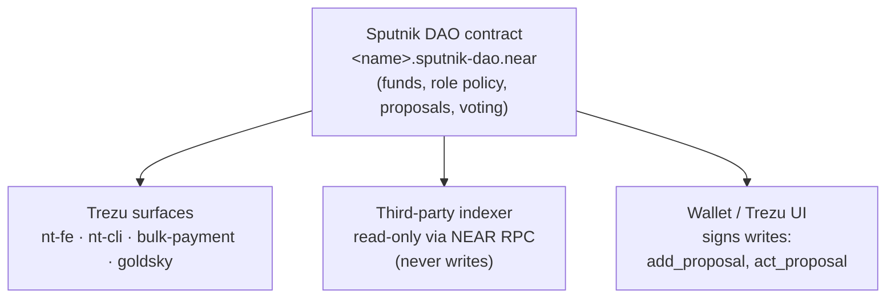

# Trezu skill

## When to use this skill

Read this skill when:
- Building a third-party indexer or dashboard that reads Sputnik DAO state (role policy, proposals, treasury balance)
- Designing role-based gating for an endpoint that depends on DAO membership
- Designing a route accessible to admins OR a wider authenticated audience gated by DAO role
- Considering submitting proposals from your indexer/dashboard (don't — read this skill first)
- Integrating against the Sputnik DAO ABI from any third-party context
- Needing to map between Trezu's role vocabulary and on-chain Sputnik role names

## System diagram



## What Trezu is

Trezu is a non-custodial **multi-chain multisig treasury platform built on NEAR**. Per Trezu's docs, treasuries can hold assets across 30+ chains (Ethereum, Solana, Bitcoin, Polygon, NEAR, Sui, TON, Cardano, etc.) from a single platform. The architecture splits cleanly:

- **The on-chain treasury itself is a Sputnik DAO contract** at `<name>.sputnik-dao.near` (a NEAR account). Trezu does not invent a new treasury contract — existing Sputnik DAOs are usable with Trezu by signing in with the account that created them. The Sputnik DAO is the source of truth for governance, members, and proposals. Per Trezu's docs and monorepo, cross-chain operations (both swaps and payments) route through **NEAR Intents** (a multi-chain swap protocol).
- **Trezu adds, around that Sputnik DAO** (per the [`NEAR-DevHub/trezu`](https://github.com/NEAR-DevHub/trezu) monorepo):
  - `nt-fe` — Near Treasury Frontend (Next.js web UI at `trezu.app`; docs at `docs.trezu.org`).
  - `nt-be` — Near Treasury Backend (Rust/Axum indexer for balance / event tracking + CSV export).
  - `nt-cli` — Trezu CLI (Rust binary `trezu`, installable via shell/PowerShell/npm; v0.1.0+). Alternative operator surface to the web UI; covers `address_book / auth / members / payments / requests / treasury` modules. Useful for scripted ops, CI/CD, or terminal-preferring operators.
  - `contracts/bulk-payment` — helper contract for batched payouts (up to 100 per batch with a storage-credit system).
  - Token vesting schedules with cliff dates and configurable release (per the trezu monorepo README's Features section).
  - "Pay with NEAR Treasury" — external integration that NEARN consumes (per `nearTreasury.dao` on the Sponsor Prisma model) to pay contributors against the DAO.
  - `goldsky/` — event-indexing subgraph configuration (for high-throughput historical event reads).

So "Trezu" refers to that surrounding stack of UI + services + helper contracts; the on-chain custody and governance live in the Sputnik DAO.

Per Trezu's docs, the security model rests on three concepts: multiple members (each with their own wallet), role-based permissions (Requestor / Finance / Governance), and voting thresholds (configured separately for Governance and Finance proposals).

## Role-naming caveat (important)

**Trezu's docs and UI label three roles: `Requestor`, `Finance`, `Governance`** (per `governance/members-and-roles`), with permissions:
- **Requestor** — create payment, staking, and asset-exchange requests; delete own pending requests.
- **Finance** — vote to approve/reject Finance proposals (payments, swaps, staking).
- **Governance** — create member-management / threshold / theme requests; vote on Governance proposals.

**Critical:** these labels are UI-only. **For a Trezu-managed Sputnik DAO, the on-chain role names returned by `get_policy().roles[].name` are different:**

| Trezu UI label | On-chain role name |
|---|---|
| Requestor | `Requestor` |
| Finance | `Approver` |
| Governance | `Admin` |

So when a third-party indexer or dashboard integrates with a Trezu-managed DAO, the names it must check against are `Requestor` / `Approver` / `Admin` — not `Finance` / `Governance`. This is invisible to operators using only the Trezu UI but load-bearing for any external code that calls `userInRole(...)` or filters proposals by role.

For an existing Sputnik DAO that pre-dates Trezu (or was created with the Sputnik default policy), the names will be different again — the `default_policy()` function uses `all` (open AddProposal permission for everyone) and `council` (the founding member group with vote/finalize permissions). Other DAOs may use entirely custom role names set in their original policy.

**Before integrating with any specific DAO**, call `get_policy({})` once and read the actual role names from `policy.roles[].name`. Configure your role-checking layer to match. Don't hardcode role names — even Trezu-managed DAOs require this discipline (the UI labels won't match what's on-chain).

**Role-name drift after launch:** if a Governance proposal renames a role on the DAO, your role-checking configuration must update too. There's no on-chain notification mechanism; you either re-read `get_policy` aggressively (cost: more RPC) or push the rename through your config layer manually.

## Sputnik DAO contract surface

Source: [`near-daos/sputnik-dao-contract`](https://github.com/near-daos/sputnik-dao-contract) — contract at `sputnikdao2/`, factory at `sputnikdao-factory2/`.

### View methods (read-only)

| Method | Returns | Notes |
|---|---|---|
| `version()` | string | Contract version. Diagnostics. |
| `get_config()` | `{ name, purpose, metadata }` | DAO identity. |
| `get_policy()` | `{ roles: [{ name, kind, permissions }, ...], proposal_bond, proposal_period, ... }` | Role policy + voting params. |
| `get_staking_contract()` | account id | Staking contract (if delegation enabled). |
| `get_locked_storage_amount()` | yocto string | Storage-locked balance. |
| `get_available_amount()` | yocto string | Liquid NEAR balance available to spend. |
| `delegation_total_supply()` / `delegation_balance_of({ account_id })` / `delegation_balance_ratio({ account_id })` | yocto string / ratio | Token-weighted voting state (if used). |
| `get_last_proposal_id()` | u64 | Proposal counter. |
| `get_proposals({ from_index, limit })` | array | Paginated proposal list. |
| `get_proposal({ id })` | proposal | Single proposal detail (status, kind, votes). |
| `get_bounty({ id })` / `get_last_bounty_id()` / `get_bounties({ from_index, limit })` / `get_bounty_claims({ account_id })` / `get_bounty_number_of_claims({ id })` | bounty data | Sputnik's NATIVE bounty system (see "Bounty terminology" below). |
| `get_factory_info()` | factory metadata | The factory that created this DAO. |
| `has_blob({ hash })` | bool | Code blob storage utility. |

### Change methods (write, called via tx)

| Method | Notes |
|---|---|
| `new({ config, policy })` | DAO factory init. |
| `migrate()` | Version migration. |
| `add_proposal({ proposal })` | Submit new proposal. Kinds (per `proposals.rs`): `ChangeConfig`, `ChangePolicy`, `AddMemberToRole`, `RemoveMemberFromRole`, `FunctionCall`, `UpgradeSelf`, `UpgradeRemote`, `Transfer`, `SetStakingContract`, `AddBounty`, `BountyDone`, `Vote`, `FactoryInfoUpdate`, `ChangePolicyAddOrUpdateRole`, `ChangePolicyRemoveRole`, `ChangePolicyUpdateDefaultVotePolicy`, `ChangePolicyUpdateParameters`. |
| `act_proposal({ id, action, proposal, memo? })` | Act on an existing proposal. Required args: `id`, `action`, and `proposal` (the kind, for verification — must match the on-chain kind or call panics with `ERR_WRONG_KIND`); optional `memo`. Valid actions: `VoteApprove`, `VoteReject`, `VoteRemove`, `RemoveProposal`, `Finalize`, `MoveToHub`. (`AddProposal` action specifically panics here — use `add_proposal()` method instead.) |
| `bounty_claim({ id, deadline })` / `bounty_done({ id, account_id, description })` / `bounty_giveup({ id })` | Sputnik bounty workflow. |
| `register_delegation({ account_id })` / `delegate({ account_id, amount })` / `undelegate({ account_id, amount })` | Token-weighted voting (if staking enabled). |
| `store_blob()` / `remove_blob({ hash })` | Code blob storage. |

### Common third-party indexer subset

For an external indexer reading DAO state, the load-bearing read methods are:

- **`get_policy()`** — for role-based admin gating. Cache aggressively (60s+ TTL is reasonable; role policy rarely changes).
- **`get_proposal({ id })`** — for syncing local workflow status against on-chain proposal lifecycle (payment status, AddMember outcome, etc.). One-shot per known proposal id.
- **`get_available_amount()`** — for liquid NEAR balance on the DAO account; combine with NEP-141 `ft_balance_of()` calls against each token contract for per-token treasury balances.
- **`get_proposals({ from_index, limit })`** — for paginated proposal-list surfaces (event feeds, audit views).

NEP-141 `ft_balance_of({ account_id })` is the standard NEP-141 fungible-token interface called against each token contract (USDC, wNEAR, etc.) — not a Sputnik DAO method.

### Bounty terminology — important distinction

Two unrelated things share the word "bounty":

- **Sputnik bounties** (`get_bounty` / `bounty_claim` / `bounty_done`, plus `add_proposal({ kind: AddBounty })`): the Sputnik DAO contract's NATIVE bounty system. Work is posted on-chain via a proposal; contributors claim / complete via the contract.
- **NEARN bounties**: NEARN.io listings of type `bounty`. Off-chain posting; contributors apply via NEARN. Payouts may settle through a Sputnik DAO via "Pay with NEAR Treasury", but the bounty itself is NOT a Sputnik bounty.

In contexts where contributor sourcing is deferred to NEARN (or any other off-chain talent platform), the relevant bounty surface is that platform, not Sputnik native bounties. Sputnik bounties remain available for any DAO that wants an on-chain bounty workflow without an external listing platform.

### Proposal lifecycle (Sputnik DAO)

`InProgress` (during voting period) → terminal:
- `Approved` — threshold met, proposal executed (FunctionCall etc. fired automatically).
- `Rejected` — vote-reject threshold met.
- `Removed` — vote-remove threshold met (e.g., spam).
- `Expired` — voting period elapsed without resolution.
- `Moved` — the proposal was routed elsewhere via the `MoveToHub` action (transferring it to a Sputnik Hub contract for cross-DAO coordination). Rare in typical single-DAO ops.
- `Failed` — executed but the inner call errored (e.g., insufficient treasury balance for a `Transfer`).

When polling proposal status from an external indexer:
- `Approved` → executed successfully (e.g., a `Transfer` payment moved).
- `Failed` → executed but the inner call errored. Distinguish from `Rejected` in any UX you surface — this is a technical failure, not a governance decision.
- `Rejected` / `Removed` / `Expired` / `Moved` → terminal but did not execute. `Rejected` and `Removed` are deliberate vote outcomes; `Expired` is a no-decision timeout; `Moved` means the proposal was routed to another contract.
- `InProgress` → only non-terminal status.

## nt-be HTTP API — indexer-backed vs RPC-proxy endpoints

`nt-be` (production: `https://near-treasury-backend.onrender.com`) exposes ~70 HTTP endpoints, but they don't all share the same backing model. Two patterns matter for any third-party reader weighing the API as a data source.

**Indexer-backed (real value-add over direct RPC):**
- `GET /api/balance-changes`, `/api/recent-activity`, `/api/balance-history/*`
- Backed by `indexed_dao_outcomes` and balance-change tables populated by the goldsky streaming pipeline (`goldsky/pipelines/near-execution-outcomes.yaml`).
- Captures historical execution outcomes — transfers, FT/MT moves, intents — that aren't directly reconstructible via standard Sputnik DAO view methods. Faster and more complete than walking receipts via RPC.

**RPC proxy with cache (no indexer behind these):**
- `GET /api/proposals/{dao_id}`, `/api/proposal/{dao_id}/{proposal_id}`, `/api/proposal/{dao_id}/{proposal_id}/tx`
- `GET /api/treasury/{policy,config,...}`
- Implementation calls `fetch_proposals()` / `fetch_policy()` against NEAR RPC and wraps the result in a short-term cache tier. Same data as a direct `get_proposals` / `get_policy` call, behind Trezu's shared cache. Consuming these gets you a shared cache but no architectural advantage over your own RPC layer.

**The goldsky pipeline itself is operator-deployed.** It sinks to Trezu's private Postgres (`secret_name: TREZU_RENDER`); there is no public Goldsky GraphQL endpoint for sputnik DAO data. To get equivalent indexing for any payload nt-be doesn't expose (e.g., parsed proposal lifecycle events from `indexed_dao_outcomes`), deploy your own pipeline — Trezu's YAML is a reusable reference.

**Auth model:**
- Read endpoints accept `OptionalAuthUser` — anonymous reads are allowed.
- `POST /api/auth/challenge` + `POST /api/auth/login` for wallet-signed sessions; subscription plans gate certain mutations.

**Decision shortcut:**

| Need | Use |
|---|---|
| Proposal status (one or many) | Direct RPC (`get_proposal` / `get_proposals`) with your own cache. nt-be offers no architectural advantage and adds an external dep. |
| Balance / treasury history beyond a current snapshot | nt-be `/api/balance-changes` if the external dep is acceptable; reconstructing the same data from RPC alone is significantly harder. |
| Indexed DAO event data nt-be doesn't expose | Replicate the goldsky pipeline + Postgres sink pattern. The YAML config is reusable. |

## Operator workflows (where each happens)

| Action | Where the operator does it |
|---|---|
| Set up the DAO | Trezu setup flow (or directly via Sputnik DAO factory) |
| Add/remove members | Trezu UI (`add_proposal({ kind: AddMemberToRole / RemoveMemberFromRole })` + voting) |
| Authorize a transfer from the treasury | Trezu UI (Finance proposal: `Transfer`) |
| Execute a payment | Trezu UI (Finance proposal: `Transfer` with the recipient/amount); record the resulting tx hash off-chain if the integrating system tracks settlement |
| Configure DAO voting thresholds | Trezu UI (Governance proposal: `ChangePolicy*`) |

Third-party indexers typically track workflow around these actions in off-chain tables of their own; the on-chain proposals remain the source of truth.

## Decision guidance

| Question | Answer |
|---|---|
| New admin-only endpoint — how to gate? | Use a role-gating middleware: load the DAO role names from your config layer (populated from `get_policy()`), check via `userInRole(daoAccountId, callerAccountId, roleName)`. |
| New endpoint accessible to admins OR a wider authenticated audience (e.g., users with a domain-level association to the resource)? | Use a session-only middleware (auth + has NEAR account, no role check) + an inline policy check in the handler that combines the role check with your domain-level association check. |
| Need to query DAO state from a third-party app? | Read from NEAR RPC; cache `get_policy` aggressively (60s+ TTL is reasonable, role policy rarely changes). Cache other reads per their staleness tolerance. |
| Need to submit a proposal from your app? | **Don't.** Surface a hint pointing operators at Trezu UI / wallet; proposal signing belongs in operator-controlled wallet UIs, not in indexers/dashboards. |
| Bounty work — Sputnik native (`add_proposal({ kind: AddBounty })`) or NEARN listing? | NEARN, when contributor sourcing is deferred to NEARN. See "Bounty terminology" section. |
| Cache invalidation for role membership after a DAO proposal? | Either wait out your TTL or surface a manual refresh action. There's no push notification from Sputnik DAOs. |

## Worked example: admin gating from a route handler

The canonical pattern for gating a route handler on DAO admin/approver membership (oRPC shown; same pattern works for tRPC/REST/etc.):

```typescript
adminListSomething: route
  .use(requireDAOAdminRole)                  // your role-gating middleware
  .handler(async ({ context, input }) => {
    const { daoAccountId, adminRoleName } = await loadDAOConfig();
    // context.callerAccountId is guaranteed populated by the gate middleware
    // the gate has already run userInRole(daoAccountId, callerAccountId, adminRoleName)
    return { data: await db.select()... };
  });
```

For a wider audience (admins OR users with a domain-level association to a specific resource), use a session-only middleware + inline policy:

```typescript
.use(requireAuthenticatedSession)
.handler(async ({ context, input }) => {
  const { daoAccountId, adminRoleName, approverRoleName } = await loadDAOConfig();
  const [isAdmin, isApprover] = await Promise.all([
    userInRole(daoAccountId, context.callerAccountId, adminRoleName),
    userInRole(daoAccountId, context.callerAccountId, approverRoleName),
  ]);
  if (!isAdmin && !isApprover) {
    const hasResourceAccess = /* your domain-level association check */;
    if (!hasResourceAccess) throw new ForbiddenError(...);
  }
  return { ... };
});
```

Note the indirection: role names come from your config layer (which the operator populates from `get_policy()` once at integration time), not from hardcoded string literals.

## Deep-linking to Trezu UI

For surfaces that observe DAO state and want to send the operator/member to Trezu for the actual write action (vote, finalize, etc.), the URL shape derives from `nt-fe`'s Next.js route tree (`NEAR-DevHub/trezu` → `nt-fe/app/(treasury)/[treasuryId]/...`). The `(treasury)` route group is unrouted, so `[treasuryId]` sits directly after the host:

| Surface | URL |
|---|---|
| DAO landing | `https://trezu.app/<daoAccountId>` |
| All requests | `https://trezu.app/<daoAccountId>/requests` |
| Single request (per-proposal page) | `https://trezu.app/<daoAccountId>/requests/<proposalId>` |
| Payments section | `https://trezu.app/<daoAccountId>/payments` |
| Members | `https://trezu.app/<daoAccountId>/members` |
| Settings | `https://trezu.app/<daoAccountId>/settings` |

`<daoAccountId>` is the full Sputnik DAO account (e.g. `build.sputnik-dao.near`); `<proposalId>` is the numeric Sputnik proposal id (cast to string at the URL boundary is fine — Trezu's route reads it as a string). Open in a new tab from your indexer/dashboard so the operator's session on your surface stays intact.

These URLs are derived from `nt-fe` source, not from a published API contract — they're as stable as Trezu's frontend routing. Re-verify by opening the route in a browser if a future Trezu refactor breaks the pattern.

## Gotchas

- **Role-name drift** — if a Governance proposal renames a role on the DAO, your role-checking layer's configured role names must be updated to match. There's no on-chain push notification; if you cache `get_policy` (recommended for performance), the rename won't reflect until the cache TTL expires.
- **`get_policy` should be cached** — role membership changes via DAO proposals won't reflect in your gate until the cache expires. 60s TTL is a reasonable starting point; surface a manual refresh action if responsiveness matters more than RPC cost.
- **Trezu UI is implicit on a given DAO** — there's no separate "Trezu account" to configure. Once you have a `daoAccountId`, Trezu's UI operates on it; the operator just needs to log in at trezu.app with a wallet that's a member of the DAO.
- **Don't submit proposals from a read-only indexer/dashboard** — by design. Proposal signing belongs in operator-controlled wallet UIs (Trezu, MyNearWallet, Meteor, etc.); embedding it in an indexer mixes read and write surfaces in ways that complicate auth, key custody, and audit. If you decide to add an in-app proposal flow later, treat it as an architectural change, not a feature add.
- **Mainnet vs testnet** — Trezu provisions the DAO on whatever NEAR network the operator's wallet is on. An external integration must point its NEAR RPC at the same network (`https://rpc.mainnet.near.org` for mainnet, `https://rpc.testnet.near.org` for testnet) — otherwise every DAO read fails with "account does not exist."
- **Voting duration is uniform across proposal kinds.** Trezu's voting duration setting applies to BOTH Governance and Finance proposals — you can't set different durations per kind. When predicting when an `InProgress` proposal will resolve, use the same `proposal_period` from `get_policy()` regardless of proposal kind.
- **Members can hold multiple roles.** A single NEAR account can be granted multiple roles in a DAO's policy, with permissions combining additively. For a Trezu-managed DAO, an operator listed as both Finance and Governance in the UI shows up under both `Approver` and `Admin` in `get_policy().roles[].members`. A `userInRole(daoAccountId, accountId, roleName)` call returning `true` for one role does NOT mean the account is exclusively in that role. If gating logic depends on role exclusivity, check each role explicitly and combine; don't infer from a single positive check.
- **Treasury must hold the funds for an `Approved` proposal to actually execute.** Sputnik DAO contracts execute the inner call (Transfer, FunctionCall, etc.) automatically when the approval threshold is reached, but the call can fail if the treasury doesn't hold sufficient balance for the requested token. The proposal status moves to `Failed` (not `Approved`). When tracking outcomes from an indexer, surface `Failed` as a technical execution failure — distinct from `Rejected` (governance vote-down) and `Expired` (no decision).

## Reference

- Trezu docs: https://docs.trezu.org/ (start at `what-is`, then `governance/members-and-roles`, `governance/voting-settings`)
- Trezu official skill (auto-generated, end-user-scoped): https://docs.trezu.org/skill.md
- Trezu docs source: https://github.com/NEAR-DevHub/trezu-docs (MDX, top-level: `home.mdx` / `what-is.mdx` / `ledger.mdx` / `swap.mdx` + `governance/` + `payments/`)
- Trezu monorepo: https://github.com/NEAR-DevHub/trezu (`nt-fe/` UI, `nt-be/` indexer, `nt-cli/` CLI, `contracts/bulk-payment/` helper contract, `goldsky/` subgraph)
- Trezu CLI releases: https://github.com/NEAR-DevHub/trezu/releases?q=trezu-cli
- Sputnik DAO factories: `sputnik-dao.near` (mainnet, deploys `<name>.sputnik-dao.near`); `sputnik-v2.testnet` (testnet, deploys `<name>.sputnik-v2.testnet`)
- Sputnik DAO contract source: https://github.com/near-daos/sputnik-dao-contract/tree/main/sputnikdao2
- Sputnik DAO factory source: https://github.com/near-daos/sputnik-dao-contract/tree/main/sputnikdao-factory2
